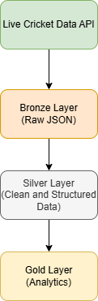
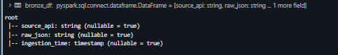
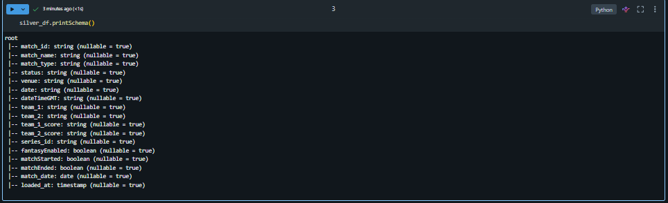
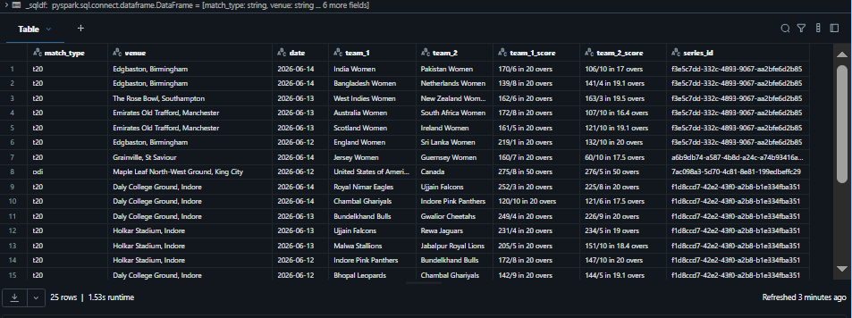
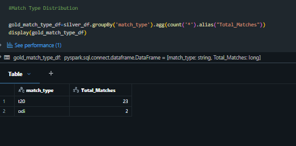
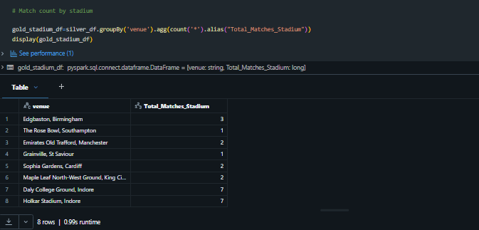
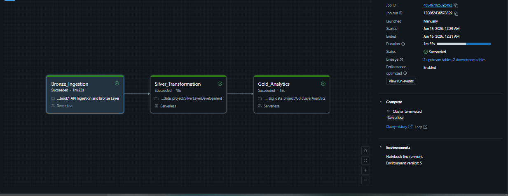
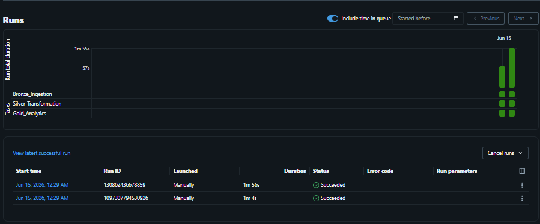

# 🏏 Live Cricket Data Engineering Pipeline using PySpark & Databricks

An end-to-end Data Engineering project that ingests live cricket match data from the CricketData API, processes it using PySpark, and implements a Medallion Architecture (Bronze-Silver-Gold) in Databricks.

The pipeline automates data ingestion, transformation, and analytics generation, enabling business-ready insights from live cricket match data.

---

## 🚀 Project Overview

This project demonstrates the complete lifecycle of a modern Data Engineering pipeline:

- Fetch live cricket data from CricketData API
- Store raw JSON responses in the Bronze Layer
- Transform and clean data in the Silver Layer
- Generate analytics-ready datasets in the Gold Layer
- Orchestrate the workflow using Databricks Jobs
- Perform analytical queries using Spark SQL

---

## 🏗️ Architecture



### Pipeline Flow

```text
CricketData API
        │
        ▼
Bronze Layer (Raw JSON Data)
        │
        ▼
Silver Layer (Cleaned & Structured Data)
        │
        ▼
Gold Layer (Analytics & Aggregations)
        │
        ▼
Business Insights
```

---

## 🛠️ Tech Stack

- Databricks Free Edition
- PySpark
- Spark SQL
- Delta Lake
- Unity Catalog
- Databricks Jobs
- GitHub
- CricketData API

---

## 📊 Medallion Architecture

The project follows the Medallion Architecture pattern to progressively improve data quality and usability.

### Bronze Layer

The Bronze Layer stores raw API responses without applying business transformations.

#### Features

- Raw JSON ingestion
- Delta table storage
- Source data preservation
- Ingestion timestamp tracking

#### Bronze Layer Data



---

### Silver Layer

The Silver Layer transforms nested JSON data into a structured and analytics-ready format.

#### Transformations Performed

- JSON flattening
- Data cleaning
- Column extraction
- Schema standardization
- Metadata enrichment
- Match-level data modeling

#### Silver Schema



#### Silver Sample Data



---

### Gold Layer

The Gold Layer contains business-ready analytical datasets generated from Silver data.

#### Analytics Included

- Match Type Distribution
- Team-wise Statistics
- Venue-based Analysis
- Match Summary Insights

#### Gold Analytics Query Result



#### Gold Analytics Visualization



---

## ⚙️ Workflow Orchestration

The pipeline is orchestrated using Databricks Jobs with task dependencies.

### Workflow DAG



### Execution Flow

```text
Bronze_Ingestion
        │
        ▼
Silver_Transformation
        │
        ▼
Gold_Analytics
```

This ensures that each layer executes only after the previous layer completes successfully.

---

## ✅ Successful Pipeline Execution

The screenshot below demonstrates a successful end-to-end pipeline run.



---

## 📈 Sample Business Analytics

Example analytical query used in the Gold Layer:

```sql
SELECT
    match_type,
    COUNT(*) AS total_matches
FROM gold_match_summary
GROUP BY match_type
ORDER BY total_matches DESC;
```

This query provides match distribution across different cricket formats and serves as a foundation for reporting and dashboarding.

---

## 🔥 Key Features

- Live Cricket API ingestion
- End-to-end ETL pipeline
- Medallion Architecture implementation
- Delta Lake storage
- Databricks Job orchestration
- PySpark transformations
- Spark SQL analytics
- Ingestion timestamp tracking
- GitHub version control

---

## 📂 Project Structure

```text
Live-Cricket-Data-Engineering-Pipeline/
│
├── README.md
│
├── images/
│   ├── architecture.png
│   ├── bronze.png
│   ├── silver_schema.png
│   ├── silver_example.png
│   ├── gold_query.png
│   ├── gold_chart.png
│   ├── dag.png
│   └── runs.png
│
├── notebooks/
│   ├── 01_bronze_ingestion
│   ├── 02_silver_transformation
│   └── 03_gold_analytics
│

```

---

## 🎯 Project Outcomes

- Built an end-to-end ETL pipeline using PySpark and Databricks.
- Processed live cricket match data from an external API.
- Implemented a Medallion Architecture using Bronze, Silver, and Gold layers.
- Automated workflow execution using Databricks Jobs.
- Generated analytical datasets for reporting and business insights.
- Applied Delta Lake concepts for scalable and reliable data storage.

---

## 🚀 Future Enhancements

- Incremental Data Loading
- Delta MERGE Operations
- Data Quality Validation Framework
- Audit Logging & Monitoring
- Databricks SQL Dashboards
- Star Schema Modeling
- Real-time Streaming Ingestion
- CI/CD Integration

---

## 👨‍💻 Author

**Priyansh Bobade**

- Electronics & TeleCommunication Engineering Student
- Aspiring Data Engineer & Data Analyst
- Skilled in SQL, Python, PySpark, Databricks, Tableau, and Data Analytics

---
⭐ If you found this project useful, feel free to star the repository.
